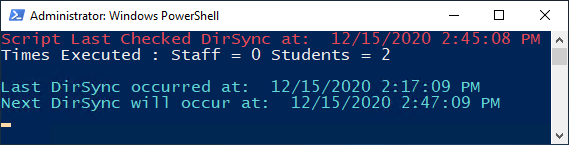

# AutoO365License
Powershell Widget that will run every ten minutes to see if new accounts exist in Office 365. 
If they do, the script will automatically assign a license depending on the accounts tittle.

Just run in and let it do its thing every ten minutes. 

.Start-Sleep -Seconds 600 - Line 129 - Change to how often you want to script to check if a new account exist.

.Make sure that the licenses are changed to your enviroment in lines 74 and 95. 

